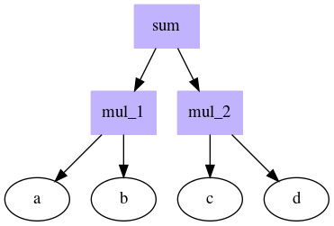
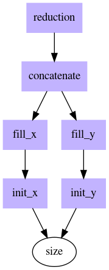
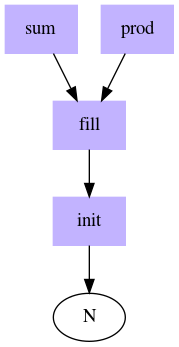
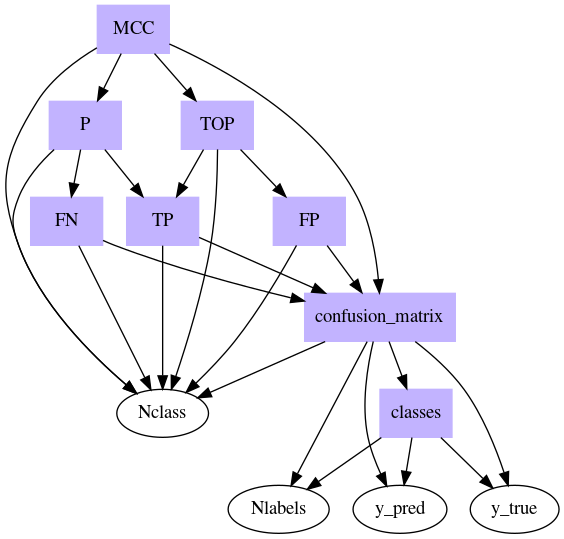

| **Authors**  | **Project** | **Build Status** | **Code Quality** |
|:------------:|:-----------:|:----------------:|:----------------:|
| [**N. Curti**](https://github.com/Nico-Curti) <br/> [**E. Giampieri**](https://github.com/EnricoGiampieri)   |  **easyDAG**  | **Linux/MacOS** : [](https://travis-ci.com/Nico-Curti/easyDAG) <br/> **Windows** : [](https://ci.appveyor.com/project/Nico-Curti/easydag) | **Codacy** : [](https://www.codacy.com/manual/Nico-Curti/easyDAG?utm_source=github.com&amp;utm_medium=referral&amp;utm_content=Nico-Curti/easyDAG&amp;utm_campaign=Badge_Grade) |


[](https://github.com/Nico-Curti/easyDAG/pulls)
[](https://github.com/Nico-Curti/easyDAG/issues)

[](https://github.com/Nico-Curti/easyDAG/stargazers)
[](https://github.com/Nico-Curti/easyDAG/watchers)


# easy Direct Acyclic Graph Scheduler

Modern C++ parallel scheduler. This project is the optimization and extension of the original [easyDAG](https://github.com/eDIMESLab/easyDAG) project in Python.

* [Prerequisites](#prerequisites)
* [Installation](#installation)
* [Usage](#usage)
* [Testing](#testing)
* [Contribution](#contribution)
* [References](#references)
* [Authors](#authors)
* [License](#license)
* [Acknowledgments](#acknowledgments)
* [Citation](#citation)

## Prerequisites

The `easyDAG` project is written in `C++` using a large amount of **c++17** features.
The package installation can be performed via [`CMake`](https://github.com/Nico-Curti/easyDAG/blob/master/CMakeLists.txt).

## Installation

1) Follow your system prerequisites [here](https://github.com/Nico-Curti/easyDAG/blob/master/docs/install.md).

2) Clone the `easyDAG` package from this repository, or download a stable release

```bash
git clone https://github.com/Nico-Curti/easyDAG.git
cd easyDAG
```

3) `easyDAG` could be built with CMake and Make or with the *build* scripts in the project.
Example:

**Unix OS:**
```bash
./build.sh
```

**Windows OS:**
```Powershell
PS \>                 ./build.ps1
```

### CMake C++ installation

We recommend the use of `CMake` for the installation since it is the most automated way to reach your needs.
First of all make sure you have a sufficient version of `CMake` installed (3.9 minimum version required).
If you are working on a machine without root privileges and you need to upgrade your `CMake` version a valid solution to overcome your problems is provided [here](https://github.com/Nico-Curti/Shut).

With a valid `CMake` version installed first of all clone the project as:

```bash
git clone https://github.com/Nico-Curti/easyDAG
cd easyDAG
```

The you can build the `easyDAG` package with

```bash
mkdir -p build
cd build && cmake .. && cmake --build . --target install
```

or more easily

```bash
./build.sh
```

if you are working on a Windows machine the right script to call is the [`build.ps1`](https://Nico-Curti/easyDAG/blob/master/build.ps1).

## Usage

The following [algebra.cpp](https://github.com/Nico-Curti/easyDAG/blob/master/example/algebra.cpp) example shows the basic APIs of **easyDAG**



```c++
#include <step.hpp>
#include <iostream>

int main ()
{
  float x1 = 1.f;
  double x2 = 2.;

  float y1 = 2.f;
  float y2 = 4.f;
                               //                    ____ a
  InputVariable a(x1);         //                   |
  InputVariable b(x2);         //         ___ mul_1 *
  InputVariable c(y1);         //        |          |____ b
  InputVariable d(y2);         //        |
                               // sum __ +           ____ c
  auto mul_1 = a * d;          //        |          |
  auto mul_2 = b * c;          //        |___ mul_2 *
  auto sum = mul_1 + mul_2;    //                   |____ d

  std :: cout << "(a * d) + (b * c) = " << sum() << std :: endl;
  // (a * d) + (b * c) = 8.f

  auto equation = (a * d) + (b * c);
  assert (equation() == sum());

  return 0;
}
```

The DAG is automatically evaluated using the template recursion of the Step object.

The result evaluation is performed asynchronously using future variables (in this case is useless this kind of optimization!).

A full list of default lambda math-functions is provided in the [math.hpp](https://github.com/Nico-Curti/easyDAG/blob/master/hpp/math.hpp) file.

### View Graph

In the [graphviz.cpp](https://github.com/Nico-Curti/easyDAG/blob/master/example/graphviz.cpp) example we show how you can use easyDAG to visualize your DAG scheme using DOT.



```cpp
const int N = 10;
const std :: string pipeline_name = "pipeline";

auto init = [](const int & N)
            {
              std :: vector < float > x(N);
              return x;
            };

auto fill = [](std :: vector < float > x)
            {
              std :: fill(x.begin(), x.end(), 1.f);
              return x;
            };

auto concat = [](std :: vector < float > x, std :: vector < float > y)
              {
                std :: vector < float > res(x.size() + y.size());
                std :: copy_n(x.begin(), x.size(), res.begin());
                std :: copy_n(y.begin(), y.size(), res.begin() + x.size());
                return res;
              };

auto reduce = [](std :: vector < float > res)
                {
                  return std :: accumulate(res.begin(), res.end(), 0.f);
                };

auto size = InputVariable(N);
size.set_name(size);

Task init_x(init, size);
Task init_y(init, size);

init_x.set_name(init_x);
init_y.set_name(init_y);

Task fill_x(fill, init_x);
Task fill_y(fill, init_y);

fill_x.set_name(fill_x);
fill_y.set_name(fill_y);

Task concatenate(concat, fill_x, fill_y);
concatenate.set_name(concatenate);

Task reduction(reduce, concatenate);
reduction.set_name(reduction);

reduction.graphviz(std :: cout, pipeline_name);
```

We set a name to each step (the default value is just `Task`).

The work-flow can be summarized as:

* we create two vectors starting from just a dimension size;
* we fill the two vectors with some values;
* we concatenate them;
* we apply a sum reduction.

The DAG is written in the stdout in the DOT format so if you want to visualize the png you can re-direct the stdout to a file and use the command:

```bash
dot -Tpng graph.dot > reduction.png
```

**Note:** The default settings highlight computational step as boxes while variables as circle nodes.

### Cached values

In the [cached.cpp](https://github.com/Nico-Curti/easyDAG/blob/master/example/cached.cpp) example we proof the usage of cached values into the DAG evaluation.



```cpp
const int N = 10;

auto init = [&](const int & N)
            {
              std :: cout << "I'm the initializer" << std :: endl;
              float * x = new float[N];
              return x;
            };
auto fill = [&](float * x)
            {
              std :: cout << "I'm the filler" << std :: endl;
              std :: fill_n(x, N, 1.f);
              return x;
            };
auto sum  = [&](float * x)
            {
              std :: cout << "I'm the sum reduction" << std :: endl;
              return std :: accumulate(x, x + N, 0.f);
            };

auto prod = [&](float * x)
            {
              std :: cout << "I'm the prod reduction" << std :: endl;
              return std :: accumulate(x, x + N, 1.f, std :: multiplies < float >());
            };

auto a = InputVariable(N);

Task init_step(init, a);
Task fill_step(fill, init_step);
Task sum_step(sum, fill_step);
Task prod_step(prod, fill_step);

auto result = sum_step();
std :: cout << "Summation result: " << result << std :: endl;

// Re-calling the same evaluation the lambdas are not recomputed (aka no cout)!
std :: cout << "Re-called sum value: " << sum_step () << std :: endl;

// But also if we use common steps they do not need to be re-computed!
std :: cout << "Product result: " << prod_step() << std :: endl;
```

If the DAG has been already evaluated its dependencies are not re-computed.

In this way long computations but also common steps do not need to be evaluated several times!

## A more advance example

Starting from the [`scorer`](https://github.com/Nico-Curti/scorer) project we can rewrite the computation of the Matthews Correlation Coefficient using a DAG scheme.

You can find the full list of lambdas in the [mcc.cpp](https://github.com/Nico-Curti/easyDAG/blob/master/example/mcc.cpp) example.



```cpp
auto yt = InputVariable(y_true);
yt.set_name(y_true);

auto yp = InputVariable(y_pred);
yp.set_name(y_pred);

auto n_labels = InputVariable(Nlabels);
n_labels.set_name(Nlabels);

auto n_class = InputVariable < int >();
n_class.set_name(Nclass);

// Compute the unique classes
Task classes(get_classes, yt, yp, n_labels, n_labels);
classes.set_name(classes);

// set the Nclass as step for printing
n_class.set(Nclass);

// Compute the confusion matrix
Task confusion_matrix(get_confusion_matrix, yt, yp, n_labels,
                      classes, n_class);
confusion_matrix.set_name(confusion_matrix);

// Compute the True Positive
Task TP(get_TP, confusion_matrix, n_class);
TP.set_name(TP);
// Compute the False Positive
Task FP(get_FP, confusion_matrix, n_class);
FP.set_name(FP);
// Compute the False Negative
Task FN(get_FN, confusion_matrix, n_class);
FN.set_name(FN);

// Compute the Test outcome positive
Task TOP(get_TOP, TP, FP, n_class);
TOP.set_name(TOP);
// Compute the Condition positive or support
Task P(get_P, TP, FN, n_class);
P.set_name(P);

// Compute the Matthews Correlation Coefficient
Task MCC(get_overall_MCC, confusion_matrix, TOP, P, n_class);
MCC.set_name(MCC);

auto res = MCC();

std :: cout << "Matthews Correlation Coefficient: " << res << std :: endl;
```

### Useful API

The [helper.h](https://github.com/Nico-Curti/easyDAG/blob/master/include/helper.h) and [utils.h](https://github.com/Nico-Curti/easyDAG/blob/master/include/utils.h) scripts include some useful APIs to manage `Task` variables.

First of all you can check the type of the current variable with

```cpp
float x = 2.f;
int y = 2;
auto a = InputVariable(x);
auto b = InputVariable < decltype(y) > ();

auto sum1 = a + b;

static_assert ( utils :: is_variable < decltype(x)    > :: value == true,  "It is a variable");
static_assert ( utils :: is_variable < decltype(a)    > :: value == true,  "It is a variable");
static_assert ( utils :: is_variable < decltype(b)    > :: value == true,  "It is a variable");
static_assert ( utils :: is_variable < decltype(sum1) > :: value == false, "It is not a variable");
static_assert ( utils :: is_step     < decltype(x)    > :: value == false, "It is not a step");
static_assert ( utils :: is_step     < decltype(a)    > :: value == false, "It is not a step");
static_assert ( utils :: is_step     < decltype(b)    > :: value == false, "It is not a step");
static_assert ( utils :: is_step     < decltype(sum1) > :: value == true,  "It is a step");
```

In this way you can check at **compile time** the variable types.

If you have already build a DAG you can be interested about the number of operations involved in the computation.

To this purpose the `utils :: OperationCount` can summarize you these kind of information. For example:

```cpp
float x1  = 10.f;
double x2 = 2.;

float y1 = 3.f;
float y2 = 4.f;

auto a = InputVariable(x1);
auto b = InputVariable(x2);
auto c = InputVariable(y1);
auto d = InputVariable(y2);

auto sum = (a * b) + (c + d) + x1;

auto cnt = utils :: OperationCount < decltype(sum) >();

std :: cout << "The current DAG has " << cnt.num_variables  << " variables" << std :: endl;
std :: cout << "The current DAG has " << cnt.num_operations << " operations" << std :: endl;
std :: cout << "The current DAG has " << cnt.num_nodes      << " nodes" << std :: endl;

// The current DAG has 5 variables
// The current DAG has 4 operations
// The current DAG has 9 nodes
```

## Testing

`easyDAG` uses CMake to build a full list of tests. You can disable tests setting the `-DBUILD_TEST=OFF` during the building.
All the test are performed using the [`Catch2`](https://github.com/catchorg/Catch2/) (v2.11.0) library.

The test scripts can be found [here](https://github.com/Nico-Curti/easyDAG/blob/master/test).

## Contribution

Any contribution is more than welcome :heart:. Just fill an [issue](https://github.com/Nico-Curti/easyDAG/blob/master/ISSUE_TEMPLATE.md) or a [pull request](https://github.com/Nico-Curti/easyDAG/blob/master/PULL_REQUEST_TEMPLATE.md) and we will check ASAP!

See [here](https://github.com/Nico-Curti/easyDAG/blob/master/CONTRIBUTING.md) for further informations about how to contribute with this project.

## References

* [easyDAG](https://github.com/eDIMESLab/easyDAG): easyDAG Python version.
* [taskflow](https://github.com/taskflow/taskflow): modern C++ Parallel Task Programming

## Authors

*  **Nico Curti** [git](https://github.com/Nico-Curti), [unibo](https://www.unibo.it/sitoweb/nico.curti2)

*  **Enrico Giampieri** [git](https://github.com/EnricoGiampieri), [unibo](https://www.unibo.it/sitoweb/enrico.giampieri)

See also the list of [contributors](https://github.com/Nico-Curti/easyDAG/contributors) [](https://github.com/Nico-Curti/easyDAG/graphs/contributors/) who participated in this project.

## License

The `easyDAG` package is licensed under the MIT "Expat" License. [](https://github.com/Nico-Curti/easyDAG/blob/master/LICENSE.md)

## Acknowledgments

Thanks goes to all contributors of this project.

## Citation

If you have found `easyDAG` helpful in your research, please consider citing this project repository

```BibTeX
@misc{easyDAG,
  author = {Curti, Nico and Giampieri, Enrico},
  title = {Easy DAG in C++},
  year = {2019},
  publisher = {GitHub},
  howpublished = {\url{https://github.com/Nico-Curti/easyDAG}},
}
```
